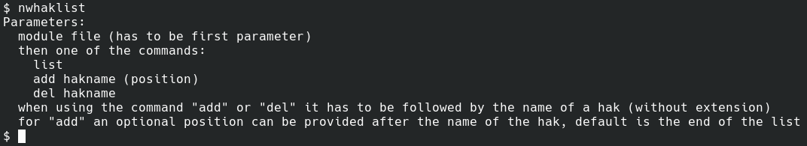
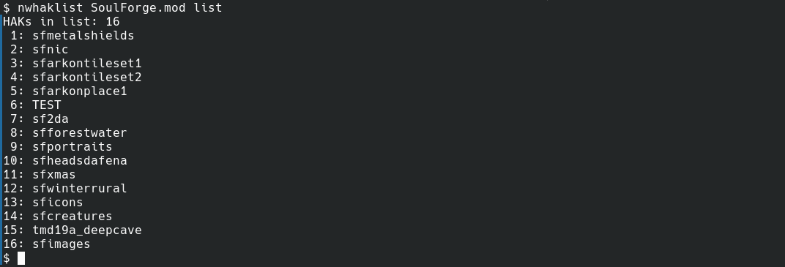
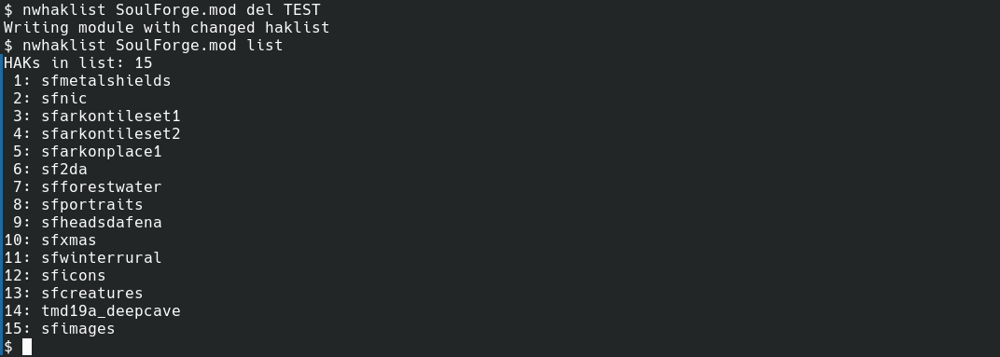
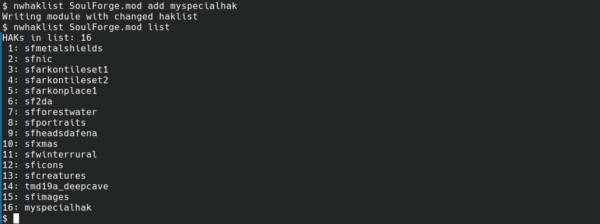
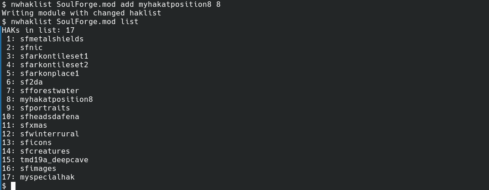

# nwhaklist
Show or modify the hak list of a [Neverwinter Nights](https://www.beamdog.com/games/neverwinter-nights-enhanced/) module.

This program is written in [Nim](https://nim-lang.org/) and uses the [neverwinter.nim](https://github.com/niv/neverwinter.nim) library.

## Download binaries
Binaries are available for download on the [releases](https://github.com/hendrikgit/nwhaklist/releases) page.

## Usage
nwhaklist has 3 basic functions. `list` the haks of a module, `add` a hak to the list or `del`ete a hak from the list.

When adding a hak the position in the list can optionally be specified.

Calling the program without any arguments will show the help text.

## Screenshots

